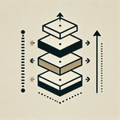

# Welcome to Christopher's Blog

## About Me

I'm Christopher Gutierrez, a data scientist and engineer specializing in building scalable, data-driven solutions for startups. From the early days of LinkedIn (500 employees) and Airbnb (200 employees), I’ve contributed as an individual contributor, architect, and leader. My expertise spans data science, engineering, and infrastructure development.
 
I’ve led projects, built teams, and delivered high-impact results. Whether you're a startup or a growing company, I bring a unique perspective shaped by my diverse roles as an IC, architect, and manager.
 
### [Experience](posts/experience.md)
A summary of my experience and the projects I've worked on. For more details, check out my [LinkedIn profile](https://www.linkedin.com/in/christophergutierrez/).

### [My Demos](posts/demos.md)
I have a website that demonstates a few tools. More importantly, I built it with an AI assistant and describe the process in a blog post.

## Blog Posts

### AI in Software Development

 | [This post describes my experience using AI for development.](posts/AI_in_Software_Development.md)
 | [This provides an overview of several other blog posts.](posts/ModernDataArchitecture.md)
 | [A detailed look into acheiving high data quality and meeting governance requirements.](posts/DataQualityAndGovernance.md)
 | [A detailed look into the Medalion Architecture and more.](posts/ArchitectureofDataPlatform.md)

## Blog Posts

### AI in Software Development

-  
  **[This post describes my experience using AI for development.](posts/AI_in_Software_Development.md)**

- 
  **[This provides an overview of several other blog posts.](posts/ModernDataArchitecture.md)**

  - 
    **[A detailed look into achieving high data quality and meeting governance requirements.](posts/DataQualityAndGovernance.md)**

  - 
    **[A detailed look into the Medallion Architecture and more.](posts/ArchitectureofDataPlatform.md)**
