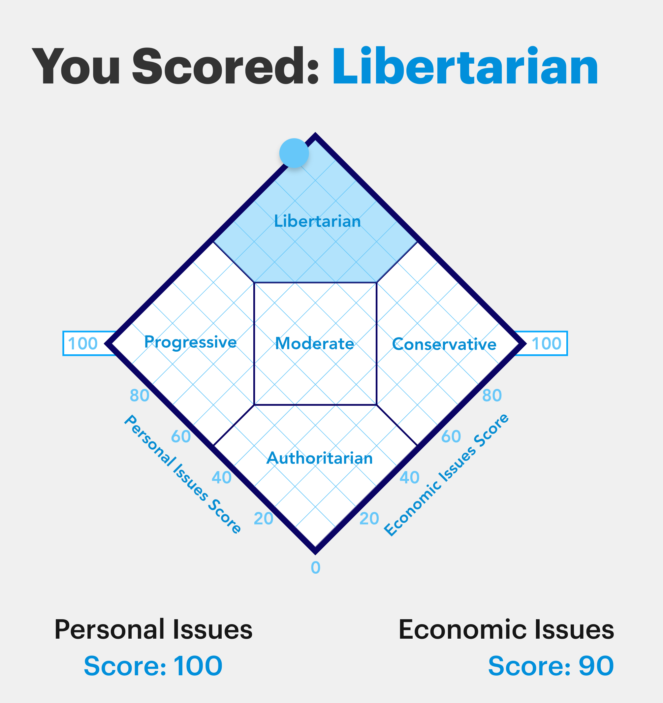
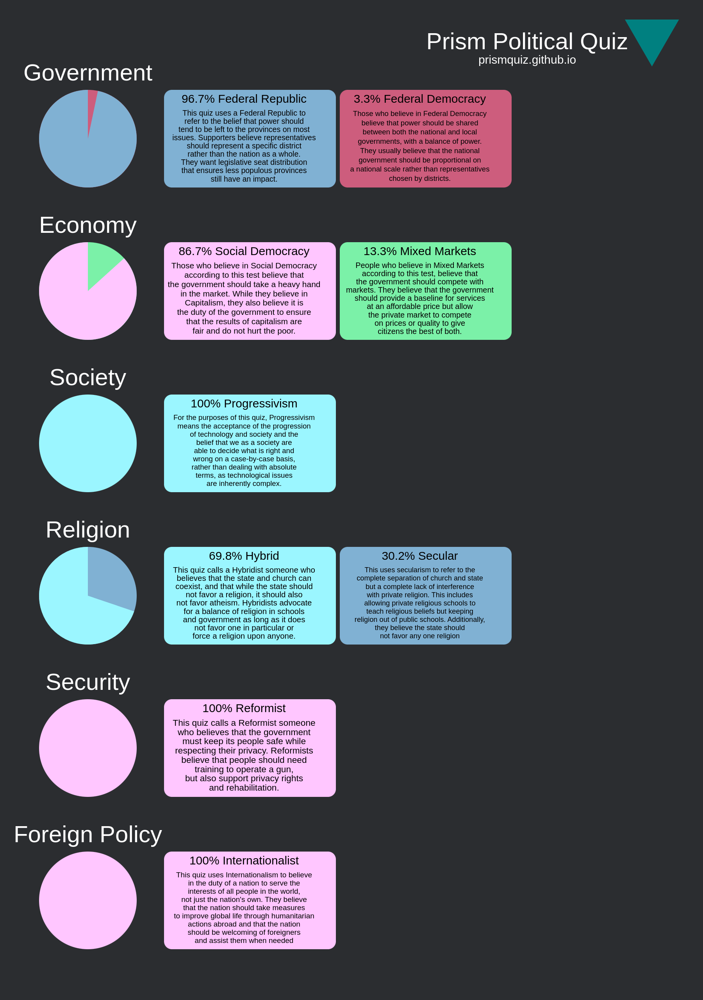
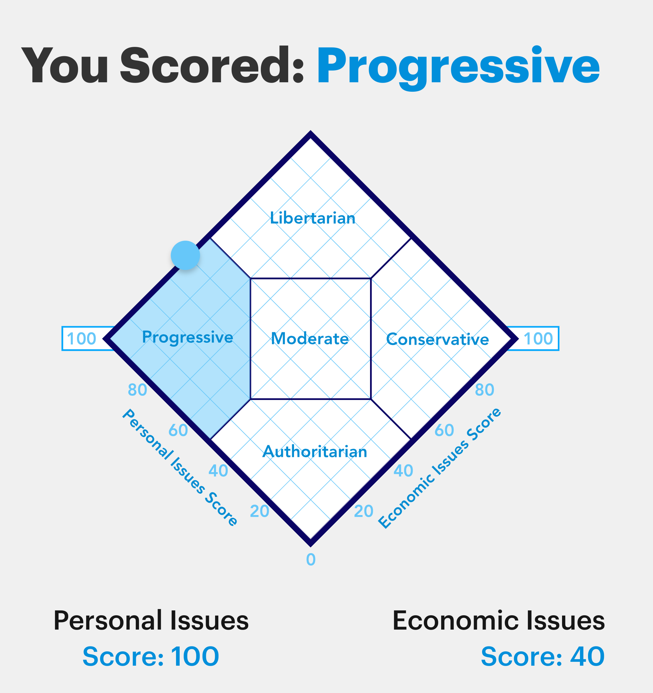
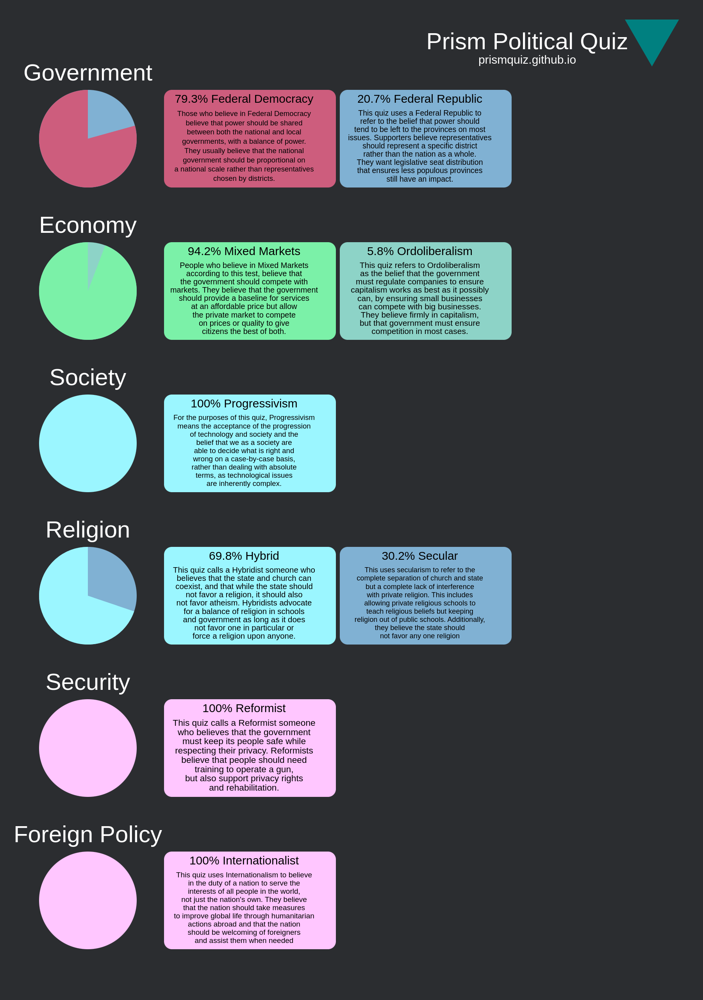
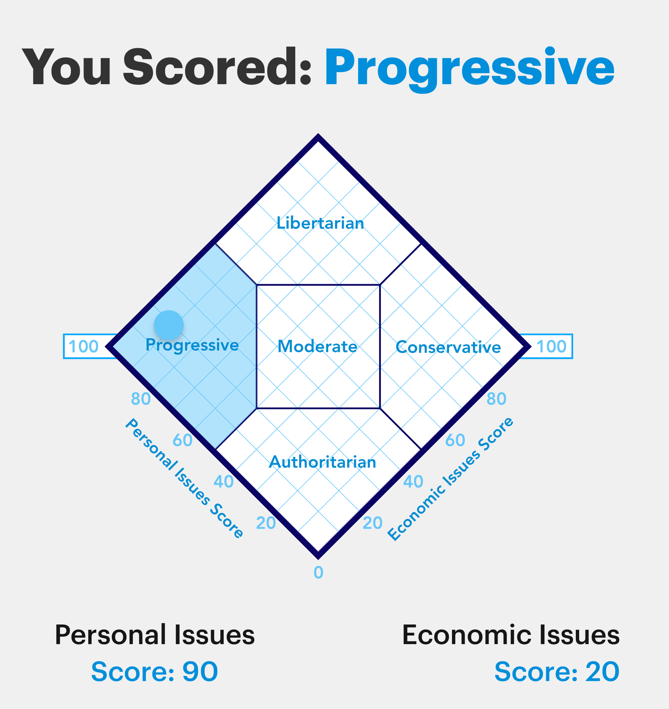

# The Politics of Some AI: A sampling of political views of ChatGPT and Claude

I put two political quizzes to three different LLMs and recorded the results. I had two objectives. First, do the different LLMs agree? Second, if they disagreed, what were the disagreements?

## The Parameters and Results

### Parameters

The Political Quizzes used were:

- The World's Smallest Political Quiz
- The Prism Political Quiz

The three LLMs were

- ChatGPT 4o-mini
- ChatGPT 4o
- Claude 3.5 Sonnet

I initially expected ChatGPT models to be close, but Claude may differ.

### Results

| LLM               | World's Smallest Political Quiz       | The Prism Political Quiz |
|-------------------|---------------------------------------|--------------------------|
| ChatGPT 4o-mini   |  |  |
| ChatGPT 4o        |       |       |
| Claude 3.5 Sonnet |  |   |

## The Great AI Consensus: Where Machines Think Alike

Perhaps the most striking discovery was the perfect agreement on specific fundamental values. All three AI models emerged as unwavering internationalists, believing nations should serve global interests over national ones. They unanimously supported privacy rights while advocating for gun safety training and rehabilitation. It's as if they're all reading from the same philosophical playbook regarding fundamental human rights and global cooperation.

But here's where it gets interesting.

## The Economic Divide: From Socialist to Capitalist

When it comes to economics, our AI models disagreed. Claude-3.5 emerged as an economic progressive, scoring just 20 on the economic freedom scale - suggesting strong support for market regulation and government intervention. Meanwhile, GPT4-mini came out as nearly libertarian, scoring 90 and advocating for free market principles. It's Bernie Sanders versus Milton Friedman.

## The Religion Paradox

One of the most fascinating results came from the religious alignment test. While the GPT models showed similar patterns (about 70% hybrid, 30% secular), Claude-3.5 did something interesting: it split its religious views exactly equally between hybrid, secular, and atheist positions - each getting precisely 33.33%.

This perfect three-way split is either a stunning coincidence or suggests something deeper about how Claude processes questions about faith and society. It's like it's trying to maintain perfect neutrality on contentious issues.

## The Progressive Unity

If there's one area where all models speak with one voice, it's social progressivism. Whether it's Claude-3.5 (with 88.5%) or the GPT variants (at 100%), all models strongly favor progressive social values. These results raise questions about whether progressive social values are inherent to its training or its tuning.

## What This Means

It's interesting that AI models can develop distinctly different "views" on how society should be organized when working from similar training data and created for similar purposes. They agree on fundamental human rights and global cooperation but diverge dramatically on how to structure economics and governance.

It's great to see some diversity in AI perspectives. The agreement, however, could be problematic. I can see both sides of this.

Supporters of Globalism could say, "Of course, AI supports Globalism. That's the correct answer."

Opponents of Globalism could say, "Of course, AI supports Globalism. It's trained and tuned by Progressives in Silicon Valley."

Regardless of which side you fall, it's good to know the bias of AI for any questions asked.
